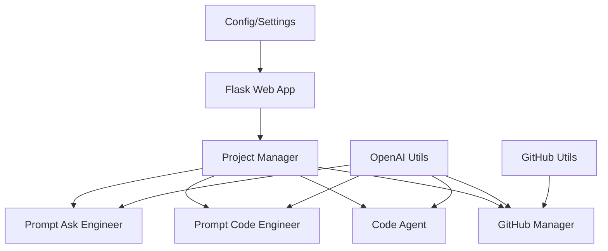
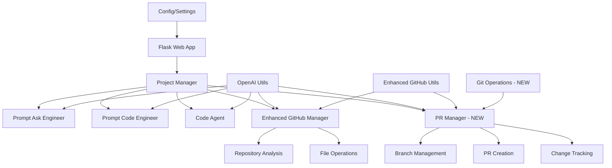

# Дизайн системи автоматизації GitHub PR

## Огляд

Система автоматизації GitHub PR є розширенням існуючої архітектури AI агентів, яка додає можливості створення Pull Request'ів з автоматично згенерованими змінами коду. Система використовує модульний підхід з окремими агентами для різних завдань та інтегрується з GitHub API для управління репозиторіями.

## Архітектура

### Поточна архітектура


### Покращена архітектура


## Компоненти та інтерфейси

### 1. Enhanced GitHub Manager
Розширений менеджер для роботи з GitHub API з додатковими можливостями:

**Нові методи:**
- `create_branch(repo_url, branch_name, base_branch="main")` - створення нового branch
- `commit_multiple_files(repo_url, branch_name, files_dict, commit_message)` - коміт декількох файлів
- `create_pull_request(repo_url, branch_name, title, description, base_branch="main")` - створення PR
- `update_file_content(repo_url, branch_name, file_path, content, commit_message)` - оновлення файлу
- `delete_file(repo_url, branch_name, file_path, commit_message)` - видалення файлу

**Покращені методи:**
- `_get_repository_summary()` - додано аналіз структури проєкту
- `_get_file_content()` - підтримка різних branch'ів
- `_list_repository_files()` - рекурсивний обхід з фільтрацією

### 2. PR Manager (Новий компонент)
Новий агент для управління процесом створення Pull Request'ів:

**Основні методи:**
- `process_pr_request(user_request, repo_url, options)` - головний метод обробки
- `generate_branch_name(request_summary)` - генерація унікальної назви branch
- `create_pr_description(changes_summary, files_changed)` - створення опису PR
- `validate_changes(files_to_change, proposed_changes)` - валідація змін
- `execute_pr_workflow(workflow_steps)` - виконання повного workflow

### 3. Git Operations (Новий компонент)
Утиліти для роботи з Git операціями:

**Методи:**
- `generate_unique_branch_name(base_name, repo_url)` - генерація унікальної назви
- `validate_branch_name(name)` - валідація назви branch
- `calculate_file_diff(original_content, new_content)` - розрахунок різниці
- `create_commit_message(changes_summary)` - генерація повідомлення коміту

### 4. Repository Analyzer (Покращення)
Розширений аналіз репозиторію для кращого розуміння контексту:

**Нові можливості:**
- Визначення типу проєкту (Python, JavaScript, etc.)
- Аналіз структури папок та файлів
- Виявлення фреймворків та бібліотек
- Аналіз стилю коду та конвенцій

## Моделі даних

### PR Request Model
```python
{
    "request_id": "uuid",
    "user_request": "string",
    "repo_url": "string",
    "options": {
        "branch_name": "string (optional)",
        "pr_title": "string (optional)",
        "pr_description": "string (optional)",
        "base_branch": "string (default: main)",
        "auto_merge": "boolean (default: false)"
    },
    "status": "pending|processing|completed|failed",
    "created_at": "datetime",
    "updated_at": "datetime"
}
```

### Change Set Model
```python
{
    "change_id": "uuid",
    "request_id": "uuid",
    "file_path": "string",
    "operation": "create|modify|delete",
    "original_content": "string (optional)",
    "new_content": "string (optional)",
    "change_summary": "string",
    "validation_status": "valid|invalid|warning"
}
```

### PR Workflow Model
```python
{
    "workflow_id": "uuid",
    "request_id": "uuid",
    "steps": [
        {
            "step_name": "string",
            "status": "pending|completed|failed",
            "result": "object",
            "error_message": "string (optional)",
            "timestamp": "datetime"
        }
    ],
    "branch_name": "string",
    "pr_url": "string (optional)",
    "completion_status": "success|partial|failed"
}
```

## Обробка помилок

### Стратегія обробки помилок
1. **GitHub API Errors**: Retry механізм з exponential backoff
2. **Authentication Errors**: Детальні повідомлення про проблеми з токенами
3. **Repository Access Errors**: Перевірка прав доступу та існування репозиторію
4. **Code Generation Errors**: Fallback до простіших рішень
5. **Network Errors**: Timeout та retry логіка

### Error Response Format
```python
{
    "error": {
        "code": "string",
        "message": "string",
        "details": "object (optional)",
        "suggestions": ["array of strings"],
        "retry_possible": "boolean"
    },
    "request_id": "uuid",
    "timestamp": "datetime"
}
```

## Стратегія тестування

### Unit Tests
- Тестування кожного агента окремо
- Mock'и для GitHub API викликів
- Тестування генерації коду
- Валідація моделей даних

### Integration Tests
- Тестування повного workflow створення PR
- Тестування з реальним тестовим репозиторієм
- Тестування різних сценаріїв помилок
- Тестування автентифікації

### End-to-End Tests
- Автоматизовані тести з реальними GitHub операціями
- Тестування різних типів проєктів
- Тестування performance під навантаженням
- Тестування rollback процедур

### Test Data Management
- Використання тестових репозиторіїв
- Cleanup процедури після тестів
- Ізоляція тестових даних
- Моніторинг використання GitHub API квот

## Безпека та аутентифікація

### GitHub Token Management
- Зберігання токенів в environment variables
- Валідація токенів при старті системи
- Обмеження scope токенів до мінімально необхідних
- Логування використання токенів (без розкриття значень)

### Repository Access Control
- Перевірка прав доступу перед операціями
- Whitelist дозволених репозиторіїв
- Логування всіх операцій з репозиторіями
- Rate limiting для API викликів

### Code Security
- Сканування згенерованого коду на вразливості
- Валідація вхідних даних
- Sanitization користувацьких запитів
- Обмеження розміру файлів та кількості змін

## Performance та масштабування

### Оптимізації
- Кешування результатів аналізу репозиторіїв
- Асинхронна обробка довготривалих операцій
- Batch операції для множинних файлів
- Compression для великих файлів

### Monitoring
- Метрики використання GitHub API
- Час відповіді для різних операцій
- Успішність створення PR
- Використання ресурсів системи

### Scalability Considerations
- Можливість горизонтального масштабування
- Queue система для обробки запитів
- Database для зберігання стану операцій
- Load balancing для множинних інстансів